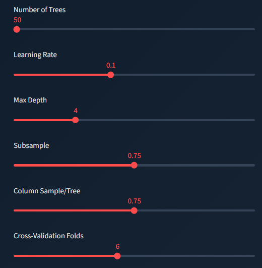
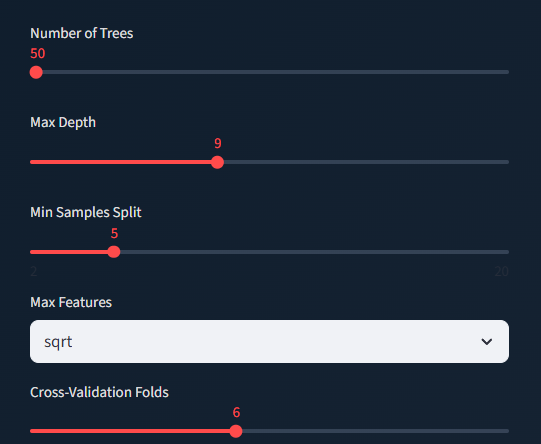
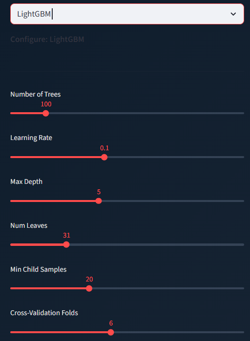
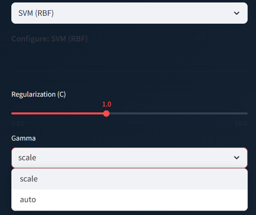
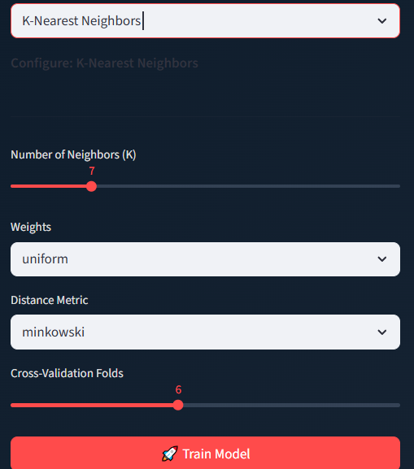

# Classification Algorithm Technical Details

**Date**: April 18, 2026 at 05:41 PM
**Turns**: 6
**Source**: [Gemini Chat](https://gemini.google.com/app/4251995564505f43)

---

## Turn 1

### 👤 User

need your help on some classification algorithm tech details for maching learning. reply ok when you are ready to help me as a professional data scientist

### 🤖 Assistant

OK. I am ready to dive into the technical details with you.
As a professional data scientist, I can help you navigate everything from the underlying mathematics of **gradient descent** and **hyperplane optimization** to the nuances of **feature engineering** and **evaluation metrics** like precision-recall curves or F1-scores.
Whether you are troubleshooting a specific model's convergence or trying to decide between a **Support Vector Machine (SVM)** and a **Gradient Boosted Tree**, I've got you covered.
Which specific classification algorithm or technical challenge should we tackle first?

## Turn 2

### 👤 User

*[This turn includes uploaded images]*

begin with xgboost. First explain the hypoprameters for me. What do they do, which changes they may cause, the direction of changes following their values change. etc. Explain with increasing complexity.

### 🤖 Assistant

To understand XGBoost (Extreme Gradient Boosting), it helps to view it as a **team of experts**. Instead of one genius making a decision, you have a sequence of "weak" experts (simple trees). Each new expert specializes in fixing the specific mistakes made by the previous ones.
The hyperparameters in your image are the "knobs" that control how this team is built and how much authority each member has.

---

## 1. The "Size" of the Team: Number of Trees

- **Technical Name:**`n_estimators`
- **What it does:** It sets how many sequential decision trees the model will build.
- **Impact & Direction:**
  - **Higher Value:** The model has more opportunities to learn from errors. However, if this is too high, the model eventually starts "memorizing" the noise in your data (**Overfitting**).
  - **Lower Value:** The model might be too simple to catch the underlying patterns (**Underfitting**).

## 2. The "Pace" of Learning: Learning Rate

- **Technical Name:**`eta`
- **What it does:** This scales the contribution of each new tree. After a tree is built to predict the current residuals (errors), its output is multiplied by this rate before being added to the total.$\hat{y}_i^{(t)} = \hat{y}_i^{(t-1)} + \eta \cdot f_t(x_i)$
- **Impact & Direction:**
  - **Lower Value (e.g., 0.01):** Makes the model more robust. Because it learns slowly, it is less likely to be swayed by outliers. **Trade-off:** You will need a higher **Number of Trees** to reach the same accuracy, increasing training time.
  - **Higher Value (e.g., 0.3):** The model converges quickly. **Trade-off:** It risks "overshooting" the optimal solution and overfitting.

---

## 3. The "Expertise" Limit: Max Depth

- **Technical Name:**`max_depth`
- **What it does:** Limits how many levels deep each individual tree can grow.
- **Impact & Direction:**
  - **Higher Value:** Allows trees to capture very complex, non-linear interactions between variables.
  - **Direction of Change:** Increasing depth exponentially increases model complexity. Usually, a depth of 3–10 is the sweet spot. Too deep, and the model captures "fluke" patterns that don't exist in the real world.

## 4. Introducing Randomness: Subsample & Column Sample
These two are your primary tools for **Stochastic Gradient Boosting**. They prevent the model from becoming too reliant on a specific set of rows or features.

### Subsample (Rows)

- **What it does:** The fraction of the total training data randomly sampled for each tree.
- **Direction:** Setting this to **0.75** (as in your image) means each tree only sees 75% of the data. This "bagging" effect reduces the variance of the model and prevents overfitting to specific observations.

### Column Sample/Tree (Features)

- **What it does:** The fraction of columns (features) to be randomly sampled for each tree.
- **Direction:** If you have 100 variables, a value of **0.75** means each tree only chooses from a random 75 of them. This is crucial if you have a few "dominant" features that might otherwise overwhelm the learning of smaller, subtler signals.

---

## 5. The "Stress Test": Cross-Validation Folds

- **Technical Name:**`k-fold CV`
- **What it does:** This isn't a model parameter, but an **evaluation** parameter. It splits your data into $k$ parts. The model trains on $k-1$ parts and tests on the remaining part, repeating this $k$ times.
- **Impact & Direction:**
  - **Higher Folds (e.g., 10):** Gives you a more "honest" and stable estimate of how the model will perform on unseen data.
  - **Lower Folds (e.g., 3):** Faster, but the performance metric might be "lucky" or "unlucky" depending on how the data was split.

---

## Summary of Hyperparameter Directions

| Hyperparameter | To Reduce Overfitting | To Reduce Underfitting |
| --- | --- | --- |
| Number of Trees | Decrease | Increase |
| Learning Rate | Decrease | Increase |
| Max Depth | Decrease | Increase |
| Subsample | Decrease (add randomness) | Increase |
| Col Sample | Decrease (add randomness) | Increase |

### The Professional's "Golden Rule"
In a professional workflow, we usually **decrease the Learning Rate** and simultaneously **increase the Number of Trees**. This combination is almost always more accurate than a fast-learning model with few trees, provided you have the computational time to let it train.
Would you like to look at how to mathematically optimize these using a **Grid Search** or **Random Search** next?

## Turn 3

### 👤 User

*[This turn includes uploaded images]*

introduce the hyperprameters of random forest

### 🤖 Assistant

While XGBoost is a team of experts learning from each other's mistakes, a **Random Forest** is a "Wisdom of the Crowd" approach. It builds many independent trees in parallel and takes a vote.
Because the trees are independent, the hyperparameters for Random Forest focus on how to make each "voter" in the crowd both smart and unique.

---

## 1. The Size of the Crowd: Number of Trees

- **Technical Name:**`n_estimators`
- **What it does:** The total number of decision trees to be built before averaging the predictions.
- **Impact & Direction:**
  - **Increasing Value:** Unlike XGBoost, adding more trees to a Random Forest **rarely leads to overfitting**. Instead, the model's performance plateaus and becomes more stable.
  - **Trade-off:** The only real "cost" of a high number of trees is computational time and memory.

---

## 2. Individual Complexity: Max Depth

- **Technical Name:**`max_depth`
- **What it does:** The maximum number of levels allowed in each tree.
- **Impact & Direction:**
  - **Higher Value (e.g., 9):** Allows each individual tree to capture more specific, complex patterns.
  - **Direction:** In Random Forest, we often allow trees to grow deeper than in XGBoost because the "averaging" process cancels out the errors of individual deep trees. However, if this is set to "None" or a very high number, the model can still overfit.

---

## 3. The "Brake" on Growth: Min Samples Split

- **Technical Name:**`min_samples_split`
- **What it does:** The minimum number of data points (samples) that must be in a node before it is allowed to split into further branches.
- **Impact & Direction:**
  - **Increasing Value (e.g., 5):** Acts as a **regularization** tool. If a node only has 3 samples left, and your limit is 5, the tree stops growing there.
  - **Direction:** Higher values prevent the model from creating branches that are too specific to a tiny group of outliers, which helps the model generalize better to new data.

---

## 4. Injecting Diversity: Max Features

- **Technical Name:**`max_features`
- **What it does:** When a tree is looking for the best way to split a node, it only looks at a random subset of your total features.
- **The "sqrt" Setting:** This is the most common professional default. If you have $p$ features, each split only considers $\sqrt{p}$ features.
- **Impact & Direction:**
  - **Why do this?** If you have one very strong predictor, every tree will use it first, making all the trees look identical. By forcing trees to ignore certain features, you ensure the trees are **de-correlated**.
  - **Direction:** Reducing this number (e.g., to `log2` or a small percentage) increases the diversity of the trees but can make individual trees weaker.

---

## 5. Reliability Check: Cross-Validation Folds

- **Technical Name:**`k-fold CV`
- **What it does:** Just like in your XGBoost model, this splits the data into 6 "buckets." It trains on 5 and tests on 1, rotating until every bucket has been the test set.
- **Professional Insight:** In Random Forest, you also get "Out-of-Bag" (OOB) error for free. Since each tree only uses a subset of data (bootstrapping), the model can test itself on the data it *didn't* use for that specific tree.

---

## Summary Comparison: RF vs. XGBoost

| Feature | Random Forest (Bagging) | XGBoost (Boosting) |
| --- | --- | --- |
| Trees | Independent / Parallel | Sequential / Dependent |
| Overfitting Risk | Low (as trees increase) | High (as trees increase) |
| Goal | Reduce Variance (Stability) | Reduce Bias (Accuracy) |
| Tree Depth | Usually deep | Usually shallow |
Since Random Forest is much harder to overfit than XGBoost, did you notice a significant difference in the gap between your Training and Test ROC curves when switching between these two algorithms?

## Turn 4

### 👤 User

*[This turn includes uploaded images]*

go over lightGBM

### 🤖 Assistant

LightGBM (Light Gradient Boosting Machine) is often considered the "faster, more efficient sibling" of XGBoost. While they both belong to the gradient boosting family, LightGBM’s primary innovation lies in **how** it grows its trees, which makes the meaning of its hyperparameters slightly different.

---

## 1. The Architectural Shift: Leaf-wise Growth
Before diving into the sliders, you must understand the core difference.

- **XGBoost** usually grows trees **level-wise** (horizontal growth). It balances the tree as it goes.
- **LightGBM** grows trees **leaf-wise** (vertical growth). it chooses the leaf that reduces the loss the most and splits it, regardless of the rest of the level.

---

## 2. The Core Parameters

### Number of Trees & Learning Rate

- **What they do:** These function identically to XGBoost. The **Number of Trees** is the total sequence of experts, and the **Learning Rate** (shrinkage) determines how much we trust each individual tree.
- **Interaction:** In LightGBM, because leaf-wise growth is more aggressive, you can often achieve high accuracy with fewer trees than XGBoost, but the risk of overfitting is higher.

### Max Depth vs. Num Leaves (The "Golden Ratio")
This is where LightGBM requires careful tuning.

- **Max Depth:** Limits how deep the tree can go.
- **Num Leaves:** This is the **most important parameter** for controlling model complexity in LightGBM. It sets the maximum number of terminal nodes in each tree.
- **The Direction:** * **Higher num_leaves:** Increases accuracy on training data but drastically increases the risk of overfitting.
  - **The Rule of Thumb:** To prevent deep, spindly trees that only capture noise, keep `num_leaves`$\le 2^{\text{max\_depth}}$. In your image, with a `max_depth` of 5, a `num_leaves` of 31 is the mathematical maximum ($2^5 = 32$).

### Min Child Samples

- **Technical Name:**`min_data_in_leaf`
- **What it does:** This is the minimum number of observations required to form a leaf.
- **Impact & Direction:**
  - **Higher Value (e.g., 20+):** Prevents the model from creating a leaf that only represents 1 or 2 specific rows of data. This is a very effective tool for **Regularization**.
  - **Direction:** If you see your Training AUC is 0.99 but your Test AUC is 0.70, **increase** this value to force the model to be more conservative.

---

## 3. Advanced Mechanics: Histogram-Based Learning
One reason LightGBM is so fast is that it doesn't look at every individual data point to find the best split. It groups continuous features into **discrete bins** (histograms).

- Instead of checking every possible value of "Income," it might group income into 255 bins.
- This reduces the complexity of finding a split from $O(\text{data} \times \text{feature})$ to $O(\text{bin} \times \text{feature})$.

---

## Summary Table: Tuning LightGBM

| Goal | Hyperparameter | Direction |
| --- | --- | --- |
| Increase Speed | num_leaves | Decrease |
| Prevent Overfitting | min_child_samples | Increase |
| Prevent Overfitting | max_depth | Decrease |
| Increase Accuracy | learning_rate | Decrease (and increase Trees) |

### Professional Insight: The "Overfit" Warning
In your previous ROC curve, we saw a near-perfect L-shape. In LightGBM, because it grows leaf-wise, it is even more prone to "sniping" specific data points in the training set. If your training results remain at 0.98+ AUC, I highly recommend:

1. Reducing `num_leaves` to something much lower (e.g., 15-20).
2. Increasing `min_child_samples` to 50 or 100, depending on your dataset size.
Should we look at how to interpret the **Feature Importance** from these models next, to see which variables are actually driving those high AUC scores?

## Turn 5

### 👤 User

*[This turn includes uploaded images]*

this svm

### 🤖 Assistant

Moving from decision trees to **Support Vector Machines (SVM)** requires a shift in mindset. While trees "split" the data into boxes, SVM tries to find a **hyperplane** (a boundary) that creates the widest possible "no-man's land" between your classes.
Since your image specifies **SVM (RBF)**, you are using the Radial Basis Function kernel. This is the "kernel trick" that allows SVM to handle data that isn't separable by a straight line by projecting it into a much higher-dimensional space.

---

## 1. The "Strictness" Knob: Regularization (C)
In the real world, data is messy. You'll almost never get a perfect split without some overlap. The **C parameter** tells the model how much you care about misclassification versus having a wide margin.

- **Higher C (e.g., 10.0, 50.0):** This is a **"Hard Margin"** approach. The model tries very hard to classify every single training point correctly.
  - **Result:** A complex, "wiggly" boundary that captures every outlier.
  - **Risk:** Extreme **overfitting**.
- **Lower C (e.g., 0.01, 0.1):** This is a **"Soft Margin"** approach. The model is willing to misclassify some points if it means the overall boundary is smoother and the "gap" (margin) is wider.
  - **Result:** A simpler, more robust boundary.
  - **Risk:****Underfitting** if set too low.

---

## 2. The "Influence" Knob: Gamma ($\gamma$)
Since the RBF kernel works by looking at the distance between points, **Gamma** determines how far the influence of a single training example reaches.
Mathematically, the RBF kernel is defined as:

$$
K(x, x') = \exp(-\gamma ||x - x'||^2)
$$

- **High Gamma:** The influence is **narrow**. Only points very close to each other are considered "similar."
  - **Result:** The model creates tight "islands" around individual data points. The boundary becomes very jagged.
  - **Direction:** Increasing Gamma makes the model more complex and prone to overfitting.
- **Low Gamma:** The influence is **broad**. Points far away from each other are still considered relevant to the boundary.
  - **Result:** The model ignores the "fine details" and creates a very smooth, sweeping boundary.

### The "Scale" vs "Auto" Options in your image:

- **scale (Default):** Uses $1 / (\text{n\_features} \times \text{X.var()})$. This is generally the professional choice as it adjusts to the variance of your data.
- **auto:** Uses $1 / \text{n\_features}$.

---

## 3. The SVM Workflow: Why it's different
Unlike the tree-based models we just discussed (XGBoost, Random Forest, LightGBM), SVM is **extremely sensitive to the scale of your data**.
Professional Warning: If you haven't standardized your features (e.g., using StandardScaler so that all variables have a mean of 0 and variance of 1), SVM will perform poorly. A feature with a range of 0–1000 will completely overwhelm a feature with a range of 0–1.
---

## Summary of Hyperparameter Directions

| Goal | Parameter C | Parameter Gamma |
| --- | --- | --- |
| To Reduce Overfitting | Decrease (Lower C) | Decrease (Lower Gamma) |
| To Fix Underfitting | Increase (Higher C) | Increase (Higher Gamma) |
| Boundary Shape | Affects "Gap" width | Affects "Smoothness" |

### How does this compare to your results?
Because SVM is more "geometric" than XGBoost, it often produces a much smoother **ROC Curve**. If your XGBoost ROC was a sharp "L," you might find that SVM gives you a more realistic, curved line—provided your data is properly scaled.
Would you like to discuss why SVM is often much slower to train on large datasets compared to LightGBM?

## Turn 6

### 👤 User

*[This turn includes uploaded images]*

do the same for knn

### 🤖 Assistant

K-Nearest Neighbors (KNN) is the "neighborhood gossip" of machine learning. It doesn't actually "learn" a complex mathematical function; instead, it simply stores the entire training dataset and, when asked to make a prediction, looks at the most similar historical cases to see how they were classified.
Because it relies entirely on distance, the hyperparameters in your image control how we define "proximity" and how much we trust our neighbors.

---

## 1. The Majority Vote: Number of Neighbors (K)

- **What it does:** This is the number of closest data points the algorithm looks at to determine the class of a new point.
- **Impact & Direction:**
  - **Small K (e.g., 1 or 3):** The model is highly sensitive to the local structure of the data. This creates a very "wiggly" decision boundary.
    - **Risk:****Overfitting**. If one data point is an outlier (noise), a $K=1$ model will follow it perfectly.
  - **Large K (e.g., 20+):** The model becomes more stable and "smooth" by averaging out the noise.
    - **Risk:****Underfitting**. If $K$ is too large, the model might start ignoring small but important local patterns, eventually just predicting the most common class in the whole dataset.

---

## 2. The Influence of Proximity: Weights
This determines how much "voice" each neighbor has in the final decision.

- **Uniform (Current Setting):** Every neighbor gets one equal vote. It doesn't matter if a neighbor is 0.1 units away or 10 units away; they have the same impact.
- **Distance:** Closer neighbors have more influence than those further away. Usually calculated as $1/distance$.
- **Professional Insight:** Use "Distance" weights if you suspect your data has a lot of "boundary" cases where a point might be closer to one class but technically surrounded by another.

---

## 3. The Measuring Stick: Distance Metric
This defines how the "distance" between two points is calculated.

- **Minkowski:** This is the generalized formula for distance.$D(x, y) = \left( \sum_{i=1}^{n} |x_i - y_i|^p \right)^{1/p}$
- **The "p" factor:**
  - If $p=1$, it becomes **Manhattan Distance** (the "taxicab" distance, moving only in right angles).
  - If $p=2$, it becomes **Euclidean Distance** (straight-line "as the crow flies" distance).
- **Impact:** Minkowski is flexible. In high-dimensional spaces, Manhattan distance ($p=1$) often performs better than Euclidean because it is less sensitive to the "Curse of Dimensionality."
[Image showing Euclidean vs Manhattan distance]

---

## 4. Complexity Level: The Curse of Dimensionality
As a professional data scientist, here is the "Increasing Complexity" warning for KNN:

1. **Scaling is Mandatory:** Like SVM, KNN is a distance-based algorithm. If one feature is "Annual Income" (0 to 1,000,000) and another is "Age" (0 to 100), the income will dominate the distance calculation. **You must normalize or standardize your data.**
2. **The "Lazy" Problem:** KNN is a "Lazy Learner." It has zero training time but **expensive prediction time**. If you have 10 million rows, the model has to calculate the distance to all 10 million rows for *every single* new prediction.
3. **Dimensionality:** As you add more features (dimensions), the "distance" between points becomes less meaningful. In 100-dimensional space, almost all points are "far away" from each other, and KNN begins to perform no better than random guessing.

---

## Summary of Directions

| Goal | Parameter K | Weights |
| --- | --- | --- |
| To Reduce Overfitting | Increase K | Switch to Uniform |
| To Fix Underfitting | Decrease K | Switch to Distance |
| To Improve Accuracy | Tuning K via CV | Ensure Scaling |
Given that your previous models (XGBoost/LightGBM) showed near-perfect ROC curves, how does the KNN ROC curve compare? Often, KNN will show a much "noisier" or lower AUC because it cannot handle complex feature interactions as well as the tree-based models.
Would you like to see how to perform a **Feature Selection** step to help KNN overcome that "Curse of Dimensionality"?

---

*Exported from [Gemini Voyager](https://github.com/Nagi-ovo/gemini-voyager)*  
*Generated on April 18, 2026 at 05:41 PM*